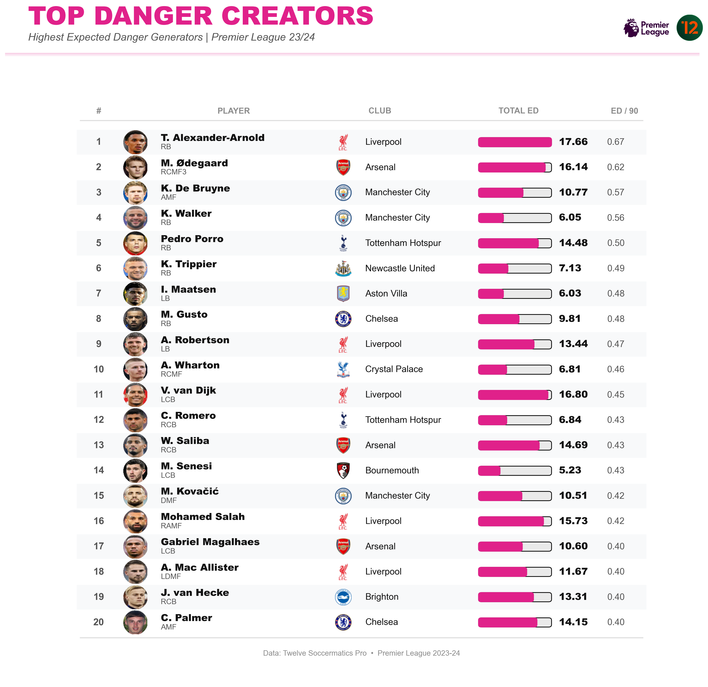
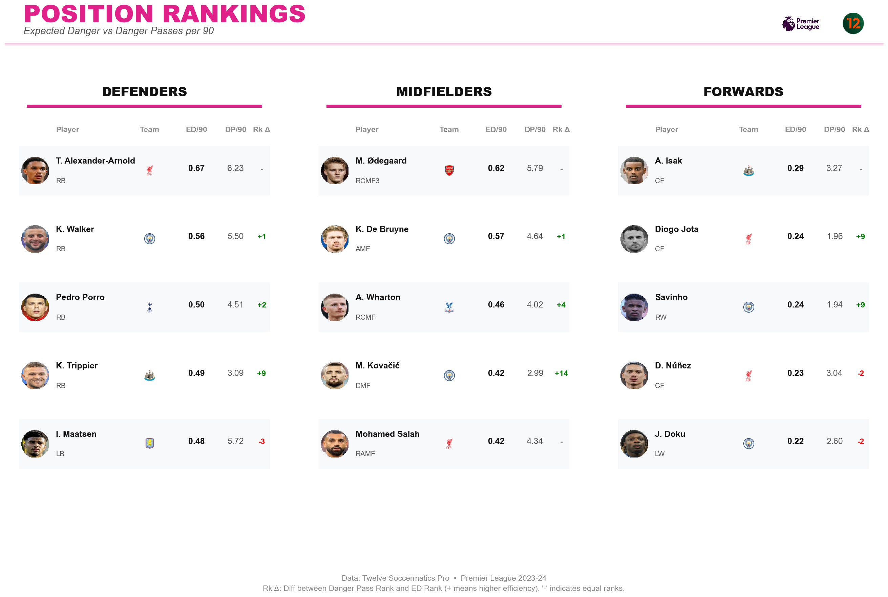
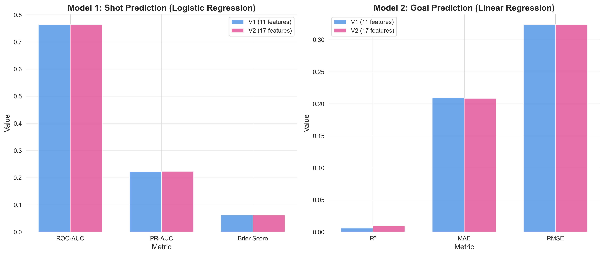
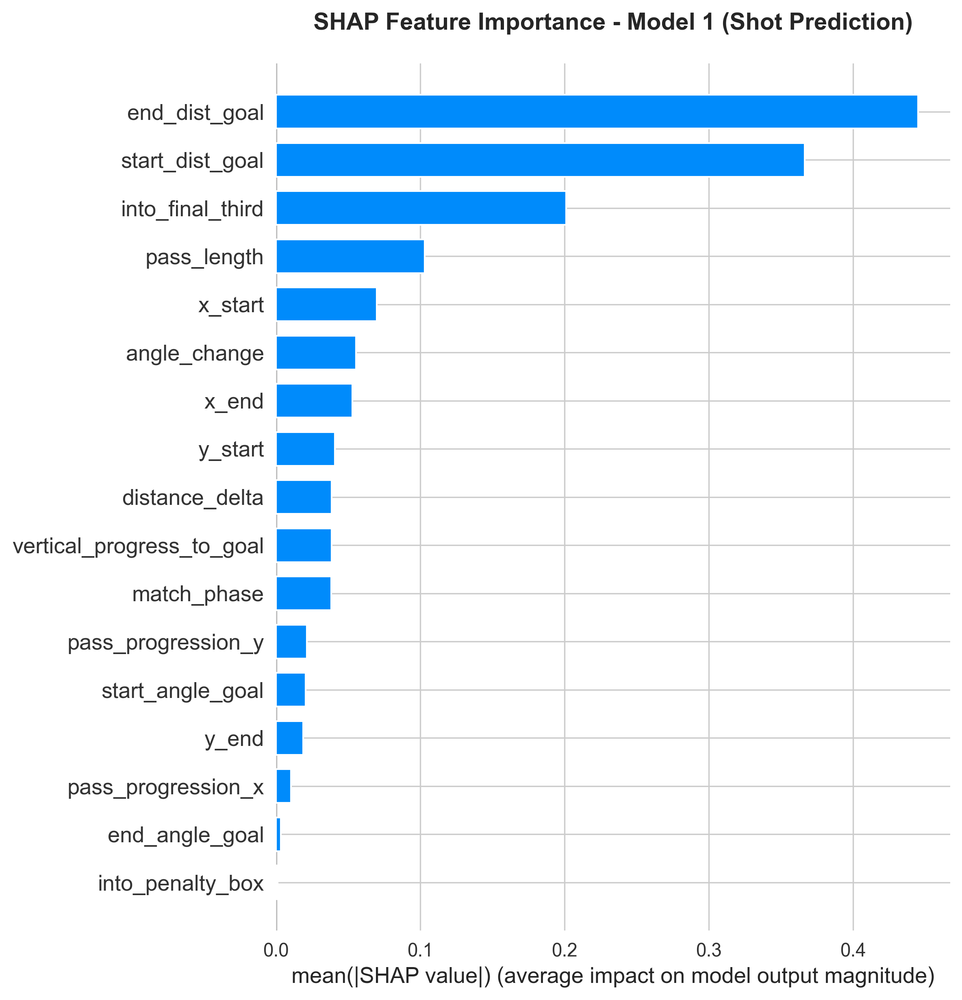
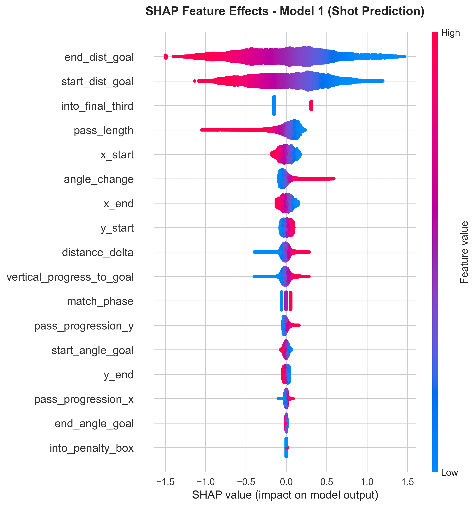
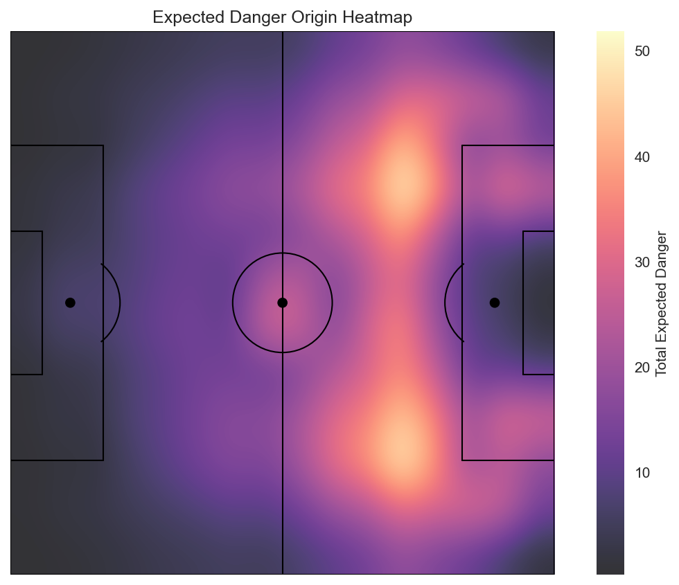
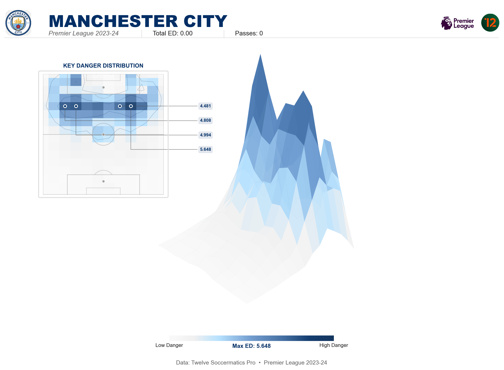
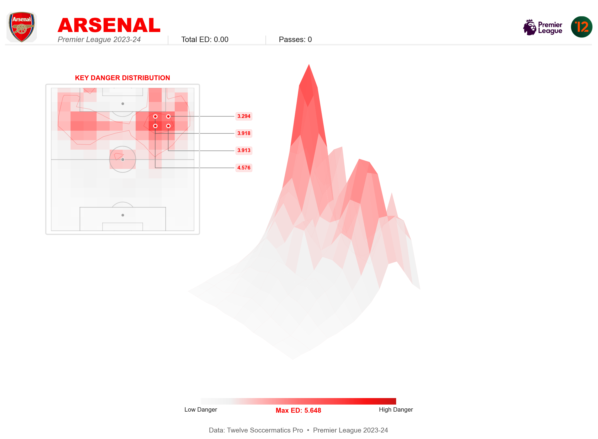
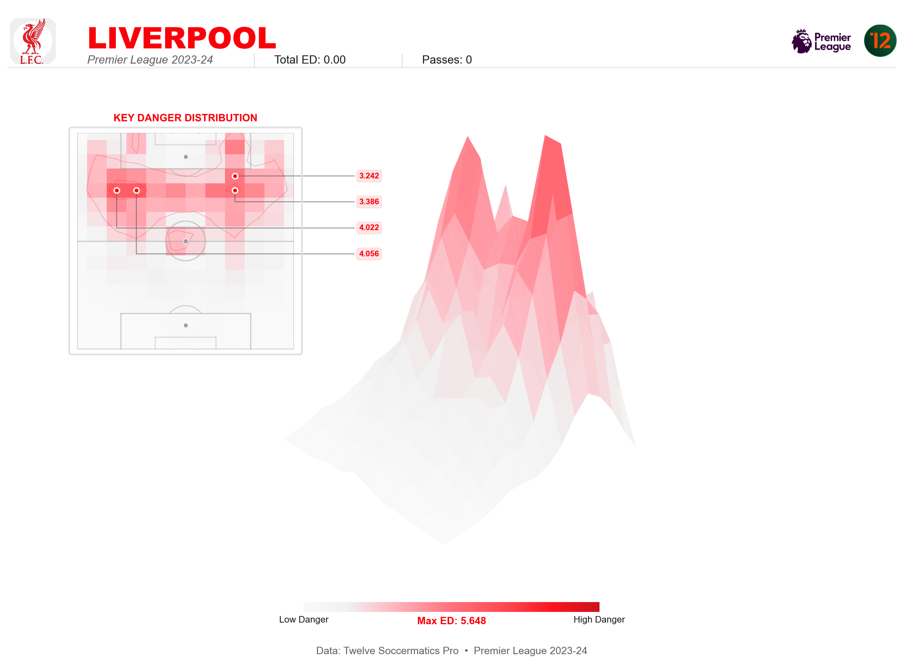

<div align="center">


# ⚽ Expected Danger Model

### *Quantifying Pass Danger in Premier League Football*

[](https://www.python.org/)
[](https://jupyter.org/)
[](LICENSE)

**Model AUC:** 0.7639 | **Features:** 17 | **Dataset:** Premier League 2023-24

[📓 View Notebook](Expected_Danger_Model.ipynb) • [⚙️ Methodology](#️-model-architecture) • [📊 Results](#-key-results)

</div>

---

## 📑 Table of Contents

- [Overview](#-overview)
- [Key Results](#-key-results)
- [Model Performance](#-model-performance)
- [Feature Importance](#-feature-importance-shap-analysis)
- [Spatial Visualizations](#-spatial-danger-visualization)
- [Model Architecture](#️-model-architecture)
- [Repository Structure](#-repository-structure)
- [Usage](#-usage)
- [Insights](#-insights)
- [Tech Stack](#️-tech-stack)
- [License](#-license)

---

## 📊 Overview

**Expected Danger (ED)** is a machine learning framework that quantifies how likely a pass will lead to a shot and goal. Unlike traditional pass completion metrics, ED evaluates the **offensive value** of passes based on spatial features, danger zones, and progression dynamics.

### What Makes a Pass Dangerous?

The model analyzes **17 key features** including:

- 📍 **Spatial positioning**: Distance and angle to goal
- 🎯 **Danger zones**: Penalty box & final third penetration
- ⚡ **Pass dynamics**: Progression, length, and angle change
- ⏱️ **Temporal context**: Match phase (early/mid/late game)

### Two-Model Architecture

1. **Model 1 (Classification)**: Predicts probability a pass leads to a shot  
   - *Logistic Regression* → **AUC: 0.7639**

2. **Model 2 (Regression)**: Predicts probability of a goal given a shot  
   - *Linear Regression* → **R²: 0.0093**

**Combined:** `ED = P(Shot | Pass) × P(Goal | Shot)`

---

## 🎯 Key Results

### Top Danger Creators (Per 90 Minutes)

<div align="center">

</div>

*Premier League's most dangerous passers by Expected Danger per 90 minutes. Min. 900 minutes played.*

### Position-Based Rankings

<div align="center">

</div>

*Expected Danger rankings segmented by position, highlighting efficiency differences between pass volume and danger creation.*

---

## 🧪 Model Performance

### V1 vs V2 Comparison

<div align="center">

</div>

The **V2 model** (17 features) shows marginal improvement over **V1** (11 features):
- **+0.13% AUC** improvement
- **+0.33% R²** improvement

### Why Similar Performance?

Despite adding 6 new features, performance gains are minimal because:

1. **Feature correlation**: New features (e.g., `into_final_third`) highly correlate with existing distance-based features
2. **Dominant signals**: Distance to goal remains the primary predictor in both models
3. **Low ceiling**: Only ~8% of passes lead to shots, limiting predictive power
4. **Model consistency**: Similar top player rankings validate robustness

---

## 🔍 Feature Importance (SHAP Analysis)

### Feature Impact Distribution

<div align="center">

</div>

**Top 3 Most Important Features:**
1. **end_dist_goal** - How close the pass ends to the goal
2. **start_dist_goal** - Where the pass originates
3. **into_final_third** - Whether pass enters dangerous territory

### Feature Effects on Predictions

<div align="center">

</div>

*SHAP beeswarm plot showing how feature values (red=high, blue=low) impact model predictions. Confirms distance-based features dominate the danger signal.*

---

## 🌐 Spatial Danger Visualization

### All Teams - 3D Danger Surface Grid

<div align="center">

</div>

*Complete 3D Expected Danger surfaces for all 20 Premier League teams (2023-24 season). Each team's passing danger is visualized as a 3D surface where height represents danger concentration. Elite sides like Manchester City and Arsenal show higher peaks in the penalty area, indicating more concentrated dangerous passing.*

---

### Expected Danger Heatmap

<div align="center">

</div>

*Pitch heatmap showing Expected Danger density across all Premier League passes. The attacking third, particularly the penalty box, shows the highest concentration of dangerous passes.*

### Team-Specific Examples

<div align="center">

  

</div>

*Individual 3D surfaces for top Premier League teams showing their unique danger creation patterns.*

> 💡 **All 20 individual team 3D surfaces** are available in [`showcase/visualizations/`](showcase/visualizations/) for detailed exploration.

---

## ⚙️ Model Architecture

### Feature Breakdown

#### Original Features (9)
- `x_start`, `y_start`, `x_end`, `y_end` - Pass coordinates
- `start_dist_goal`, `end_dist_goal` - Distance to goal
- `start_angle_goal`, `end_angle_goal` - Shooting angle
- `distance_delta` - Change in distance to goal

#### Enhanced Features (8 new in V2)
- `pass_progression_x`, `pass_progression_y` - Directional movement
- `pass_length` - Pass distance
- `into_penalty_box`, `into_final_third` - Danger zone indicators (binary)
- `vertical_progress_to_goal` - Goal-oriented progression
- `angle_change` - Change in shooting angle
- `match_phase` - Game time context (early/mid/late)

### Pipeline Flow

```
Raw Pass Events
      ↓
Feature Engineering (17 features)
      ↓
Train/Test Split (80/20)
      ↓
Model 1: P(Shot | Pass)     [Logistic Regression]
Model 2: P(Goal | Shot)      [Linear Regression]
      ↓
Expected Danger = Model 1 × Model 2
      ↓
Player Rankings / Visualizations
```

### Performance Metrics

| Model | Task | Algorithm | Metric | Score |
|-------|------|-----------|--------|-------|
| Model 1 | Shot Prediction | Logistic Regression | ROC-AUC | **0.7639** |
| Model 1 | Shot Prediction | Logistic Regression | PR-AUC | 0.2234 |
| Model 1 | Shot Prediction | Logistic Regression | Brier Score | 0.0621 |
| Model 2 | Goal Prediction | Linear Regression | R² | 0.0093 |
| Model 2 | Goal Prediction | Linear Regression | MAE | 0.2086 |
| Model 2 | Goal Prediction | Linear Regression | RMSE | 0.3231 |

---

## 📁 Repository Structure

```
project_2/
├── Expected_Danger_Model.ipynb    # Main analysis notebook
├── README.md                       # This documentation
├── LICENSE                         # MIT License
├── .gitignore
│
├── assets/
│   └── twelve_logo.png            # Course branding
│
└── showcase/
    ├── performance/                # Model metrics & comparisons
    ├── rankings/                   # Player rankings visualizations
    ├── shap/                       # SHAP interpretability plots
    └── visualizations/             # Heatmaps & 3D surfaces
```

---

## 🚀 Usage

### View the Notebook

**Option 1: GitHub**  
Click [Expected_Danger_Model.ipynb](Expected_Danger_Model.ipynb) to view directly on GitHub.

**Option 2: Jupyter Notebook**  
```bash
# Clone and navigate to the repository
git clone https://github.com/DataKnight1/Soccermatics-Pro.git
cd Soccermatics-Pro/project_2

# Launch Jupyter
jupyter notebook Expected_Danger_Model.ipynb
```

**Option 3: Google Colab**  
Upload the notebook to [Google Colab](https://colab.research.google.com/) for interactive exploration.

### Requirements

The notebook is **self-contained** with all visualizations embedded as base64 images. No external data files required for viewing.

To run analysis from scratch (source data not included in repo):
```bash
pip install pandas numpy scikit-learn matplotlib seaborn shap plotly
```

---

## 📈 Insights

### Key Findings

1. **Distance dominates**: Proximity to goal is the strongest danger predictor
2. **Penalty box supremacy**: Passes into the box generate 10x more danger
3. **Position matters**: Wingers create danger differently than central midfielders
4. **Consistency is king**: Top players maintain high ED/90 across the season
5. **Diminishing returns**: Adding features beyond spatial metrics provides minimal lift

### Applications

- **🔍 Player Scouting**: Identify high-danger passers beyond assist counts
- **📊 Tactical Analysis**: Understand team passing patterns in dangerous zones
- **🎯 Opposition Prep**: Predict which players create the most shooting opportunities
- **📈 Performance Evaluation**: Measure creative output independent of finishing

---

## 🛠️ Tech Stack

- **Language**: Python 3.8+
- **ML Framework**: scikit-learn
- **Interpretability**: SHAP (SHapley Additive exPlanations)
- **Visualization**: Matplotlib, Seaborn, Plotly
- **Environment**: Jupyter Notebook

---

## 📄 License

This project is licensed under the MIT License - see the [LICENSE](LICENSE) file for details.

---

## 🙏 Acknowledgments

- **Data**: Twelve Football / StatsBomb (Premier League 2023-24)
- **Inspiration**: Expected Goals (xG) methodology adapted for pass danger quantification
- **Interpretability**: SHAP for model transparency and feature importance analysis
- **Course**: Twelve Soccermatics Pro

---

<div align="center">

**Built with ⚽ for football analytics**

[⬆ Back to Top](#-expected-danger-model)

</div>
